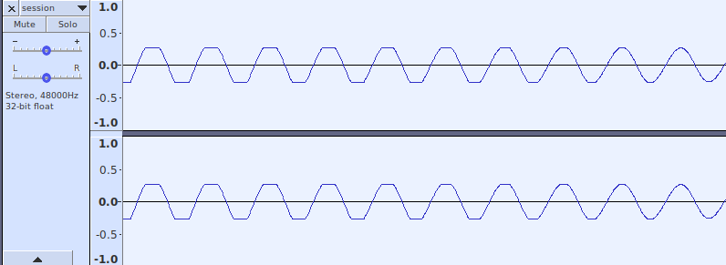

# DumbClip

DumbClip is a hard clipper that doesn't try to be smart.

## Build

DumbClip is written in [Rust](https://www.rust-lang.org/)
and is built using [cargo](https://doc.rust-lang.org/cargo/)
as shown in the example below.

    cargo build && \
    cp target/debug/libdumbclip.so dumbclip-lv2/ && \
    sudo cp -a dumbclip-lv2/ /usr/local/lib/lv2/

## Usage

DumbClip's heart is the [clamp](https://doc.rust-lang.org/std/primitive.f32.html#method.clamp)
method.
If sample values are over 1.0, they are "clamped" to 1.0.
If sample values are below -1.0, they are clamped to -1.0.

This hard clipping will not occur unless the audio signal
coming in exceeds the limits of -1.0 and 1.0.
To clip more, turn up the level of the incoming signal.

The plugin's gain control can be used to elevate the incoming signal,
or you can raise the level of the incoming signal outside the plugin.

You can lower the level coming out of the plugin to keep the level sane.

To examine the effect on the waveform live,
you can use an oscilliscope plugin
like [sisco](https://github.com/x42/sisco.lv2).
